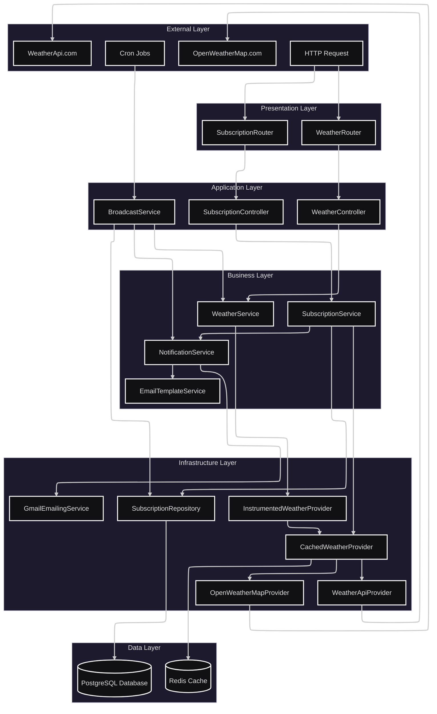

```mermaid
---
config:
  theme: redux-dark
  layout: elk
---
flowchart TD
    %% External Layer
    subgraph EL["External Layer"]
        Request[HTTP Request]
        Cron[Cron Jobs]
        OpenWeatherMap[OpenWeatherMap.com]
        WeatherApiCom[WeatherApi.com]
    end

    %% Presentation Layer
    subgraph PL["Presentation Layer"]
        WeatherRouter[WeatherRouter]
        SubscriptionRouter[SubscriptionRouter]
    end

    %% Application Layer
    subgraph AL["Application Layer"]
        WeatherController[WeatherController]
        SubscriptionController[SubscriptionController]
        BroadcastService[BroadcastService]
    end

    %% Business Layer
    subgraph BL["Business Layer"]
        WeatherService[WeatherService]
        SubscriptionService[SubscriptionService]
        NotificationService[NotificationService]
        EmailTemplateService[EmailTemplateService]
    end

    %% Infrastructure Layer
    subgraph IL["Infrastructure Layer"]
        InstrumentedWeatherProvider[InstrumentedWeatherProvider]
        CachedWeatherProvider[CachedWeatherProvider]
        WeatherApiProvider[WeatherApiProvider]
        OpenWeatherMapProvider[OpenWeatherMapProvider]
        SubscriptionRepository[SubscriptionRepository]
        GmailEmailingService[GmailEmailingService]
    end

    %% Data Layer
    subgraph DL["Data Layer"]
        Redis[(Redis Cache)]
        PostgreSQL[(PostgreSQL Database)]
    end

    %% External connections
    Request --> WeatherRouter
    Request --> SubscriptionRouter
    Cron --> BroadcastService

    %% Weather flow
    WeatherRouter --> WeatherController
    WeatherController --> WeatherService
    WeatherService --> InstrumentedWeatherProvider
    InstrumentedWeatherProvider --> CachedWeatherProvider
    CachedWeatherProvider --> WeatherApiProvider
    CachedWeatherProvider --> OpenWeatherMapProvider
    WeatherApiProvider --> OpenWeatherMap
    OpenWeatherMapProvider --> WeatherApiCom
    CachedWeatherProvider --> Redis

    %% Subscription flow
    SubscriptionRouter --> SubscriptionController
    SubscriptionController --> SubscriptionService
    SubscriptionService --> SubscriptionRepository
    SubscriptionService --> CachedWeatherProvider
    SubscriptionService --> NotificationService
    SubscriptionRepository --> PostgreSQL

    %% Broadcast flow
    BroadcastService --> WeatherService
    BroadcastService --> SubscriptionRepository
    BroadcastService --> NotificationService

    %% Notification flow
    NotificationService --> EmailTemplateService
    NotificationService --> GmailEmailingService

    EL ~~~ PL ~~~ AL ~~~ BL ~~~ IL ~~~ DL
```
