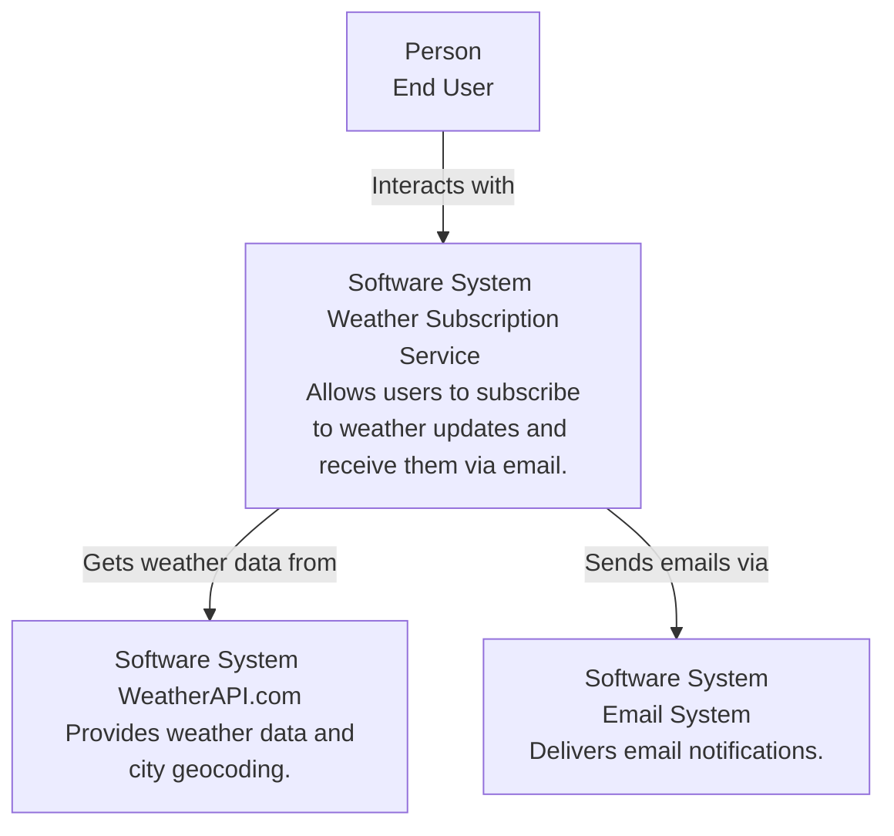
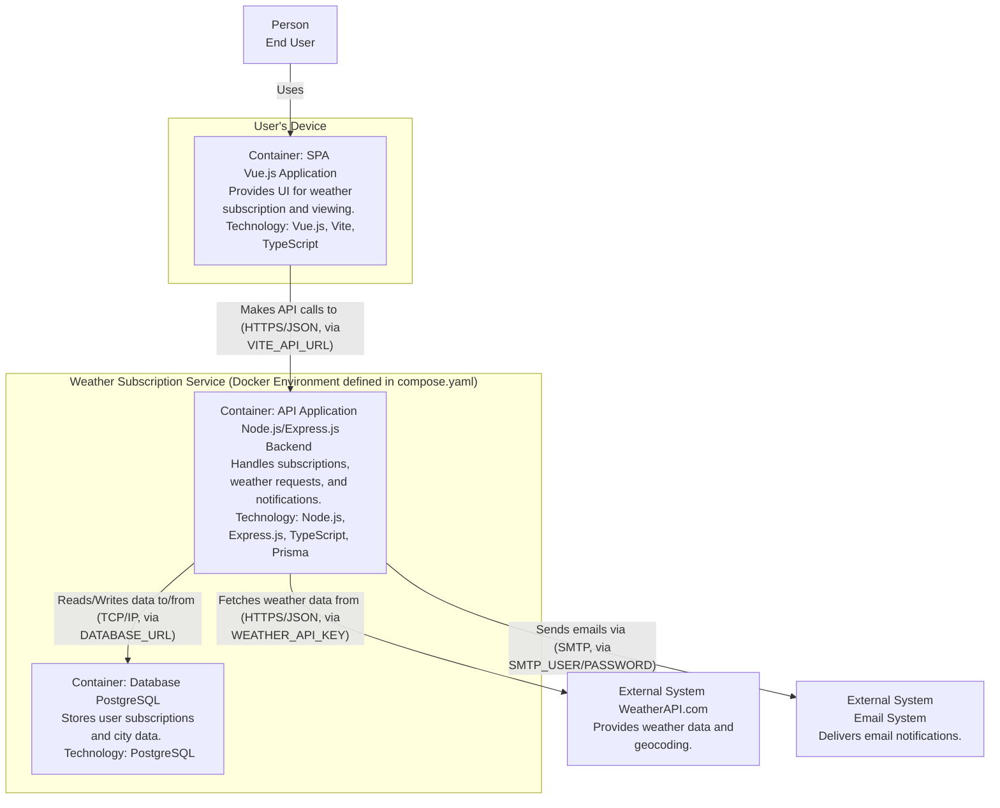
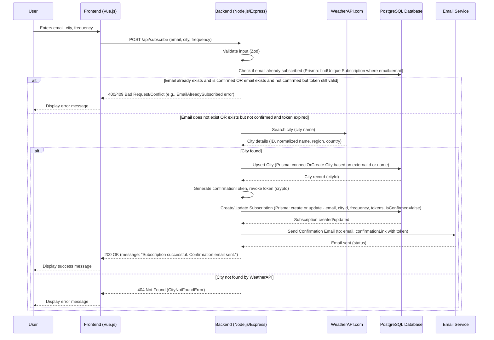
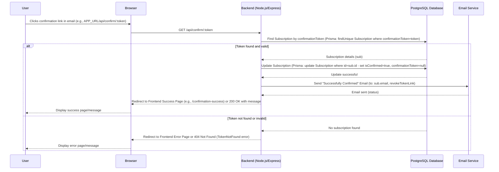
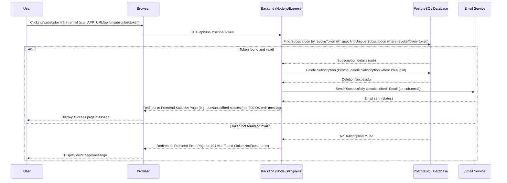
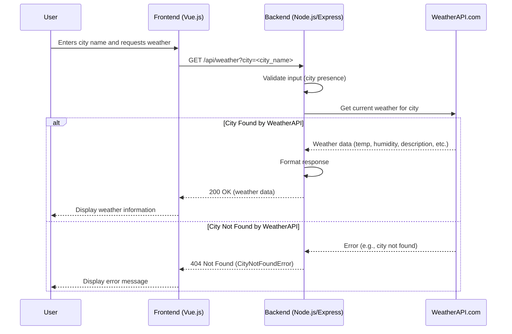
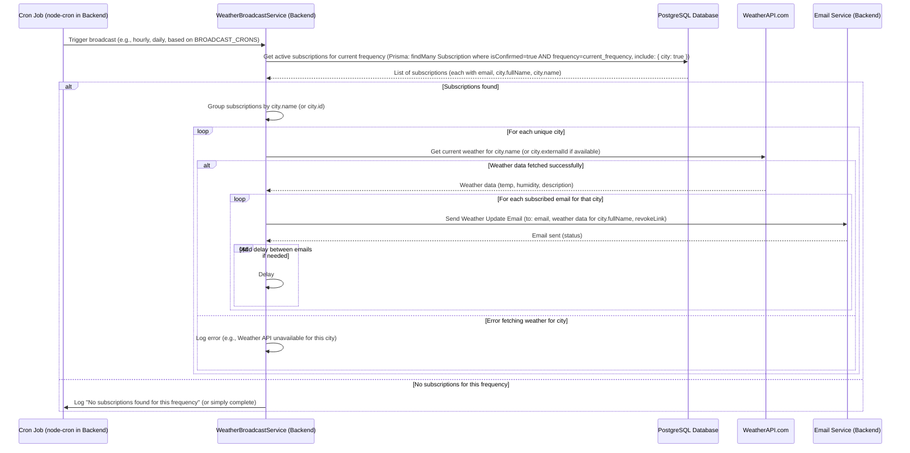

# Service Design Document: Weather Subscription Service

**Version:** 1.0
**Date:** May 18, 2025
**Author:** Volodymyr Malishevskyi

## 1. Introduction

### 1.1. Document Purpose

This document provides a comprehensive design for the Weather Subscription Service. It outlines the service's architecture, components, interactions, data models, and deployment strategy. This SDD serves as a central reference for understanding the system's design and guiding its development and maintenance.

### 1.2. Service Overview

The Weather Subscription Service allows users to subscribe to weather updates for specific cities. Users receive these updates via email at chosen frequencies (e.g., daily, hourly). The service fetches weather data from an external provider (WeatherAPI.com), manages user subscriptions, and handles email notifications. It consists of a frontend for user interaction and a backend API for core logic.

### 1.3. Acronyms and Abbreviations

- **API:** Application Programming Interface
- **CRUD:** Create, Read, Update, Delete
- **DB:** Database
- **HTTP(S):** Hypertext Transfer Protocol (Secure)
- **JSON:** JavaScript Object Notation
- **ORM:** Object-Relational Mapper
- **SDD:** Service Design Document
- **SPA:** Single Page Application
- **SMTP:** Simple Mail Transfer Protocol
- **UI:** User Interface

## 2. Goals and Objectives

### 2.1. Business Goals

- Provide users with timely and relevant weather information for their chosen cities.
- Offer a simple and intuitive way for users to manage their weather subscriptions.
- Ensure reliable delivery of weather notifications.

### 2.2. Technical Objectives

- Develop a scalable and maintainable system.
- Ensure data integrity for user subscriptions and city information.
- Provide a clear separation of concerns between frontend and backend components.
- Utilize modern and efficient technologies for development and deployment.
- Implement a robust error handling and notification system.

## 3. Scope

### 3.1. In Scope

- User registration for weather subscriptions (email, city, frequency).
- Email-based confirmation of subscriptions.
- User unsubscription.
- Fetching current weather data from an external API ([WeatherAPI.com](https://www.weatherapi.com/)).
- Storing and managing city data (normalized names).
- Storing and managing user subscription data.
- Scheduled email broadcasting of weather updates to subscribed users.
- A simple frontend UI for subscription and basic weather lookup.
- Containerized deployment using Docker and Docker Compose.

### 3.2. Out of Scope

- User accounts with passwords (subscription is email-based).
- Advanced weather forecasting (beyond current conditions provided by the API).
- Multiple notification channels (e.g., SMS, push notifications).
- User interface for managing notification history.
- Administrative interface for managing users or system settings.
- Detailed analytics or reporting.
- Payment processing for premium features.

## 4. Stakeholders

- **End Users:** Individuals who subscribe to receive weather updates.
- **Development Team:** Responsible for building, deploying, and maintaining the service.

## 5. Service Architecture (C4 Model)

### 5.1. System Context Diagram (C1)

This diagram shows the Weather Subscription Service as a black box interacting with users and external systems.

### 5.2. Container Diagram (C2)

This diagram zooms into the Weather Subscription Service, showing its high-level containers (applications and data stores).

- Frontend and Backend communication is configured via `VITE_API_URL` in `frontend/Dockerfile` (argument passed during Docker build) and used in files like [`frontend/src/api.ts`](../frontend/src/api.ts).
- Backend to Database communication is configured via `DATABASE_URL` in [`compose.yaml`](./compose.yaml).
- Backend to WeatherAPI.com is configured via `WEATHER_API_KEY` and base URL in [`backend/src/config.ts`](../backend/src/config.ts).
- Backend to Email System is configured via `SMTP_*` variables in [`compose.yaml`](./compose.yaml) and [`backend/src/config.ts`](../backend/src/config.ts).

## 6. Detailed Design

### 6.1. Frontend Application

- **Technology:** Vue.js, Vite, TypeScript. (See [`docs/ADR/ADR-004-Frontend-Technology-Stack.md`](./ADR/ADR-004-Frontend-Technology-Stack.md))
- **Key Responsibilities:**
  - Provide UI for users to input email, city, and frequency for subscription (e.g., [`frontend/src/Weather.vue`](../frontend/src/Weather.vue)).
  - Handle API calls for subscription, confirmation, unsubscription, and weather lookup (e.g., [`frontend/src/api.ts`](../frontend/src/api.ts)).
  - Display confirmation and unsubscription status pages (e.g., [`frontend/src/Confirmation.vue`](../frontend/src/Confirmation.vue), [`frontend/src/Unsubscribe.vue`](../frontend/src/Unsubscribe.vue)).
  - Client-side routing using Vue Router (e.g., [`frontend/src/router.ts`](../frontend/src/router.ts)).
- **Build Tool:** Vite (e.g., [`frontend/vite.config.ts`](../frontend/vite.config.ts)).
- **Main initialization file:** [`frontend/src/main.ts`](../frontend/src/main.ts) (from ADR-004).

### 6.2. Backend API

- **Technology:** Node.js, Express.js, TypeScript, Prisma. (See [`docs/ADR/ADR-002-Backend-Technology-Stack.md`](./ADR/ADR-002-Backend-Technology-Stack.md))
- **Main Application File:** [`backend/src/app.ts`](../backend/src/app.ts) (referenced in ADR-002)
- **Key Modules & Services:**
  - **Subscription Management:**
    - Handles user subscriptions, confirmations, and unsubscriptions.
    - Generates and validates tokens.
    - Interacts with the database to store subscription data.
    - Service: [`backend/src/modules/subscription/subscription.service.ts`](../backend/src/modules/subscription/subscription.service.ts) (referenced in ADR-002)
    - Controller: [`backend/src/modules/subscription/subscription.controller.ts`](../backend/src/modules/subscription/subscription.controller.ts)
    - Router: [`backend/src/modules/subscription/subscription.router.ts`](../backend/src/modules/subscription/subscription.router.ts)
  - **Weather Data Retrieval:**
    - Fetches current weather data for a given city from WeatherAPI.com.
    - Service: [`backend/src/modules/weather/weather.service.ts`](../backend/src/modules/weather/weather.service.ts)
    - Controller: [`backend/src/modules/weather/weather.controller.ts`](../backend/src/modules/weather/weather.controller.ts)
    - Router: [`backend/src/modules/weather/weather.router.ts`](../backend/src/modules/weather/weather.router.ts)
  - **External Weather API Service:**
    - Wrapper for interacting with WeatherAPI.com, handling requests and responses.
    - Implementation: [`backend/src/common/services/weather-api/weather-api.ts`](../backend/src/common/services/weather-api/weather-api.ts) (referenced in ADR-003)
  - **Email Notification Service:**
    - Sends emails for subscription confirmation, success, and unsubscription.
    - Uses Nodemailer.
    - Implementation: [`backend/src/common/services/gmail-emailing.ts`](../backend/src/common/services/gmail-emailing.ts)
  - **Scheduled Broadcasting Service:**
    - Periodically fetches weather data for subscribed cities and sends updates to users.
    - Uses `node-cron` for scheduling, configured via `BROADCAST_CRONS` environment variable (see [`README.md`](./README.md)).
    - Implementation: [`backend/src/common/services/weather-broadcast.ts`](../backend/src/common/services/weather-broadcast.ts)
- **Configuration:** Managed via [`backend/src/config.ts`](../backend/src/config.ts) (referenced in ADR-003) using environment variables and Zod for validation.
- **Error Handling:** Centralized error handling middleware (e.g., [`backend/src/common/middlewares/error-handle.ts`](../backend/src/common/middlewares/error-handle.ts)).

### 6.3. Database

- **Technology:** PostgreSQL. (See [`docs/ADR/ADR-001-Database.md`](./ADR/ADR-001-Database.md))
- **ORM:** Prisma ([`backend/prisma/schema.prisma`](../backend/prisma/schema.prisma)).
- **Schema Overview:**

* `City`: Stores information about cities, including `externalId` from WeatherAPI.com, normalized `name`, `region`, `country`, `latitude`, `longitude`.
* `Subscription`: Stores user `email`, `cityId` (foreign key to City), `frequency` (daily/hourly), `confirmationToken`, `revokeToken`, and `isConfirmed` status.
* Relationships: A city can have many subscriptions. A subscription belongs to one city.

### 6.4. External Service Integrations

- **WeatherAPI.com:**
  - Used for fetching current weather data and geocoding/searching cities.
  - Decision rationale: [`docs/ADR/ADR-003-Weather-Service-Provider.md`](./ADR/ADR-003-Weather-Service-Provider.md).
  - Integration: [`backend/src/common/services/weather-api/weather-api.ts`](../backend/src/common/services/weather-api/weather-api.ts) (referenced in ADR-003).
- **Email Service (e.g., Gmail SMTP via Nodemailer):**
  - Used for sending transactional emails (confirmation, notifications).
  - Integration: [`backend/src/common/services/gmail-emailing.ts`](../backend/src/common/services/gmail-emailing.ts).

## 7. Key User Journeys & Interactions (Sequence Diagrams)

### 7.1. User Subscribes to Weather Updates

### 7.2. User Confirms Subscription

### 7.3. User Unsubscribes

### 7.4. User Requests Current Weather for a City (On-Demand)

### 7.5. System Broadcasts Scheduled Weather Updates

## 8. API Design

### 8.1. Overview

The backend exposes a RESTful API for the frontend client and for handling direct calls (e.g., confirmation/unsubscription links). All API endpoints are prefixed with `/api`.

### 8.2. Key Endpoints

- **`POST /api/subscribe`**:
  - Description: Subscribes a user to weather updates.
  - Request Body: `{ "email": "string", "city": "string", "frequency": "daily" | "hourly" }`
  - Response: `200 OK` with message (e.g., `{ "message": "Subscription successful. Please check your email to confirm." }`), or error status (e.g., 400, 409).
  - Implementation: [`backend/src/modules/subscription/subscription.router.ts`](../backend/src/modules/subscription/subscription.router.ts)
- **`GET /api/confirm/:token`**:
  - Description: Confirms a user\'s subscription using a token.
  - Path Parameter: `token` (string)
  - Response: `200 OK` with message (e.g., `{ "message": "Subscription confirmed successfully!" }`) and typically redirects to a frontend page, or error status (e.g., 404).
  - Implementation: [`backend/src/modules/subscription/subscription.router.ts`](../backend/src/modules/subscription/subscription.router.ts)
- **`GET /api/unsubscribe/:token`**:
  - Description: Unsubscribes a user using a token.
  - Path Parameter: `token` (string)
  - Response: `200 OK` with message (e.g., `{ "message": "Unsubscribed successfully." }`) and typically redirects to a frontend page, or error status (e.g., 404).
  - Implementation: [`backend/src/modules/subscription/subscription.router.ts`](../backend/src/modules/subscription/subscription.router.ts)
- **`GET /api/weather?city=<city_name>`**:
  - Description: Retrieves current weather for a specified city.
  - Query Parameter: `city` (string, URL-encoded)
  - Response: `200 OK` with weather data (e.g., `{ "city": "Kyiv", "temperature": 20, "humidity": 60, "description": "Partly cloudy", "icon": "url_to_icon" }`), or error status (e.g., 400, 404).
  - Implementation: [`backend/src/modules/weather/weather.router.ts`](../backend/src/modules/weather/weather.router.ts)

### 8.3. Data Formats

All API requests and responses use JSON. Input validation is performed on the backend using Zod (as mentioned in [`backend/package.json`](../backend/package.json) and implied by ADR-002).

## 9. Data Management

### 9.1. Data Model

The data model is defined using Prisma ORM.

- Schema: [`backend/prisma/schema.prisma`](../backend/prisma/schema.prisma)
- Key Entities:

* `City`: Stores information about cities, including `externalId` from WeatherAPI.com, normalized `name`, `region`, `country`, `latitude`, `longitude`.
* `Subscription`: Stores user `email`, `cityId` (foreign key to City), `frequency` (daily/hourly), `confirmationToken`, `revokeToken`, and `isConfirmed` status.
* Relationships: A city can have many subscriptions. A subscription belongs to one city.

### 9.2. Data Flow

- User input from the frontend (subscription details, city for weather lookup) is sent to the backend API.
- The backend processes requests:
  - For subscriptions: it validates input, interacts with WeatherAPI.com to normalize city data (storing it in the `City` table if new), creates/updates a `Subscription` record, and triggers confirmation emails.
  - For weather lookups: it validates input and fetches data directly from WeatherAPI.com.
  - For scheduled broadcasts: it queries confirmed subscriptions, fetches weather for unique cities from WeatherAPI.com, and sends notification emails.
- Data is persisted in the PostgreSQL database via Prisma. Normalized city data in the `City` table helps prevent duplicate city entries and optimizes external API calls for broadcasts.

### 9.3. Data Persistence and Storage

- PostgreSQL is used for persistent storage of all application data (`City` and `Subscription` tables).
- Database migrations are managed by Prisma (`npx prisma migrate dev` as per [`README.md`](./README.md)).
- A volume `weather_db_data` is used in [`compose.yaml`](./compose.yaml) for PostgreSQL data persistence across container restarts.

## 10. Deployment Architecture

### 10.1. Overview

The application is designed to be deployed using Docker and Docker Compose.

- **[`compose.yaml`](./compose.yaml)**: Defines three main services:
  - `backend`: Node.js application.
  - `frontend`: Vue.js application served by Nginx.
  - `db`: PostgreSQL database.
- **[`backend/Dockerfile`](../backend/Dockerfile)**: Defines a multi-stage build process for the backend Node.js application. It installs dependencies, generates Prisma client, builds TypeScript, and sets up a production image with a non-root user. An `entrypoint.sh` script is used (content not provided, but typically handles migrations or other startup tasks).
- **[`frontend/Dockerfile`](../frontend/Dockerfile)**: Defines a multi-stage build process for the frontend Vue.js application. It installs dependencies, builds the static assets using Vite, and then copies these assets into an Nginx image. The `VITE_API_URL` is passed as a build argument.
- **[`frontend/nginx.conf`](../frontend/nginx.conf)**: Configures Nginx to serve the static frontend files and handle SPA routing (try_files).
- The services are orchestrated to start together with `docker compose up` (as per [`README.md`](./README.md)).

### 10.2. Environment Configuration

- Environment variables are used extensively for configuration, as detailed in the [`README.md`](./README.md).
- A root [`.env`](./.env) file is used by Docker Compose ([`compose.yaml`](./compose.yaml)) to supply variables like `DB_USER`, `DB_PASSWORD`, `DB_NAME`, `WEATHER_API_KEY`, `SMTP_FROM`, `SMTP_USER`, `SMTP_PASSWORD`.
- The backend application loads its specific configuration (e.g., `PORT`, `APP_URL`, `DATABASE_URL`, `WEATHER_API_KEY`, `SMTP_*`, `BROADCAST_CRONS`) from environment variables, likely validated by a module like [`backend/src/config.ts`](../backend/src/config.ts).
- The frontend receives its `VITE_API_URL` via a build argument in its Dockerfile, sourced from the environment at build time.

## 11. Non-Functional Requirements (NFRs)

### 11.1. Scalability

- **Backend:** Node.js's event-driven, non-blocking I/O model is well-suited for I/O-bound operations (API calls, DB interactions). The backend can be scaled horizontally by running multiple instances behind a load balancer if deployed outside the single-node Docker Compose setup.
- **Database:** PostgreSQL can be scaled using various strategies (read replicas, connection pooling, sharding if necessary, though likely overkill for the current scope).
- **Frontend:** Served as static assets by Nginx, which is highly scalable. Assets can also be served via a CDN.
- The current Docker Compose setup is for single-host deployment. For larger scale, container orchestration platforms (e.g., Kubernetes) would be considered.

### 11.2. Reliability & Availability

- **Database:** PostgreSQL is a mature and reliable RDBMS. The `healthcheck` in `compose.yaml` for the `db` service ensures the backend waits for the database to be ready. Data persistence is handled by Docker volumes.
- **Backend:** The backend application includes error handling. Docker ensures a consistent runtime environment. Restart policies can be defined in Docker Compose for services.
- **External Dependencies:** The service relies on WeatherAPI.com and an SMTP provider. The application should gracefully handle potential unavailability or errors from these external services (e.g., retries with backoff for transient errors, clear error messages to users).
- **Data Integrity:** Enforced by Prisma schema constraints, Zod validation, and transactional email confirmation process.

### 11.3. Maintainability

- **Modular Design:** The backend is structured into modules (e.g., subscription, weather) and common services, promoting separation of concerns.
- **TypeScript:** Static typing across both frontend and backend (ADR-002, ADR-004) improves code quality, refactorability, and developer understanding.
- **ADRs:** Key architectural decisions are documented in the [`docs/ADR`](./ADR) directory.
- **Code Comments & Readability:** The project aims for clear code (implied by use of linters/formatters).
- **Automated Tools:** ESLint and Prettier are used for code linting and formatting (as per [`backend/package.json`](../backend/package.json) and [`README.md`](./README.md)).
- **Clear Separation:** Frontend and Backend are distinct applications, simplifying development and deployment of each.

### 11.4. Security

- **Subscription Confirmation:** Email confirmation (double opt-in) prevents unauthorized subscriptions or subscriptions with incorrect email addresses.
- **Tokens:** Unique, cryptographically generated (assumed) tokens are used for email confirmation and unsubscription. These tokens should be single-use or have a limited validity period. The `confirmationToken` is set to null after successful confirmation as per the sequence diagram.
- **Input Validation:** Backend uses Zod for validating all incoming data from API requests.
- **Environment Variables:** Sensitive information (API keys, database credentials, SMTP credentials) is managed via environment variables and not hardcoded in the source code.
- **HTTPS:** While the current Docker Compose setup exposes HTTP, a production deployment should enforce HTTPS for all external traffic (typically handled by a reverse proxy or load balancer).
- **Docker Security:** The backend Docker image uses a non-root user (`appuser`) for enhanced security.
- **Dependency Management:** Regular updates and vulnerability scanning of dependencies (e.g., `npm audit`) are important.

### 11.5. Performance

- **Backend:** Node.js is performant for I/O-bound tasks. Prisma is a modern ORM designed for good performance. Asynchronous operations are used extensively.
- **Frontend:** Vue.js 3 with Vite provides excellent development speed and optimized production builds (small bundle sizes, efficient rendering).
- **Database:** Proper indexing is defined in `backend/prisma/schema.prisma` (e.g., `city_name_index`, unique constraints on tokens and email).
- **External API Call Optimization:** City data is fetched from WeatherAPI.com and normalized/stored locally in the `City` table. This reduces redundant API calls, especially for the weather broadcast feature where multiple users might be subscribed to the same city.
- **Caching:** Not explicitly mentioned, but could be introduced (e.g., caching WeatherAPI responses for short periods) if API rate limits become an issue or to improve response times for common requests.

## 12. Monitoring and Logging (Future Consideration)

- **Current State:** Basic console logging is likely used during development.
- **Production Recommendations:**
  - **Structured Logging:** Implement structured logging (e.g., using libraries like Winston or Pino for Node.js) to make logs more parseable and useful. Logs should be collected to a central logging system (e.g., ELK stack, Grafana Loki, cloud provider logging services).
  - **Metrics Collection:** Integrate metrics collection (e.g., Prometheus client libraries) for key application performance indicators (request rates, error rates, latency, queue lengths for broadcasts).
  - **Application Performance Monitoring (APM):** Consider APM tools (e.g., Sentry, Datadog, New Relic) for distributed tracing, error tracking, and performance insights.
  - **Health Endpoints:** Implement health check endpoints in the backend API for monitoring by orchestration tools or uptime checkers.

## 13. Future Considerations & Improvements

(Some noted in [`README.md`](./README.md))

- **API Response Wrapping:** Consistently wrap API responses in a `data` object (e.g., `{ "data": [...] }` or `{ "data": {} }`) for better backward compatibility and to allow adding metadata like pagination or versioning without breaking changes.
- **Functional Tests:** Expand automated test coverage, particularly functional/integration tests for API endpoints and key user flows.
- **Advanced Error Reporting:** Integrate a dedicated error reporting service (e.g., Sentry) for real-time error tracking and alerting in production.
- **Rate Limiting:** Implement rate limiting on API endpoints to prevent abuse.
- **More Granular Broadcast Control:** Allow users to specify preferred times for daily notifications.
- **Idempotency for Subscriptions:** Ensure `POST /api/subscribe` is idempotent or handles retries gracefully, especially if a confirmation email fails to send initially.
- **User Management Portal:** A simple UI for users to manage their existing subscriptions (e.g., change city, frequency) without needing to unsubscribe and resubscribe.
- **Internationalization (i18n):** Support for multiple languages in frontend and email notifications.

## Appendix

### A.1. Referenced Architectural Decision Records (ADRs)

- [`docs/ADR/ADR-001-Database.md`](./ADR/ADR-001-Database.md)
- [`docs/ADR/ADR-002-Backend-Technology-Stack.md`](./ADR/ADR-002-Backend-Technology-Stack.md)
- [`docs/ADR/ADR-003-Weather-Service-Provider.md`](./ADR/ADR-003-Weather-Service-Provider.md)
- [`docs/ADR/ADR-004-Frontend-Technology-Stack.md`](./ADR/ADR-004-Frontend-Technology-Stack.md)
