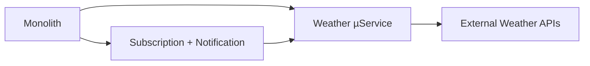
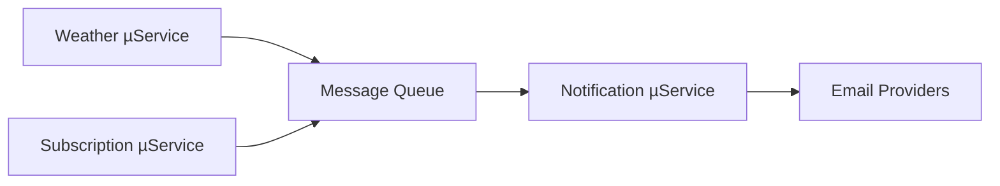
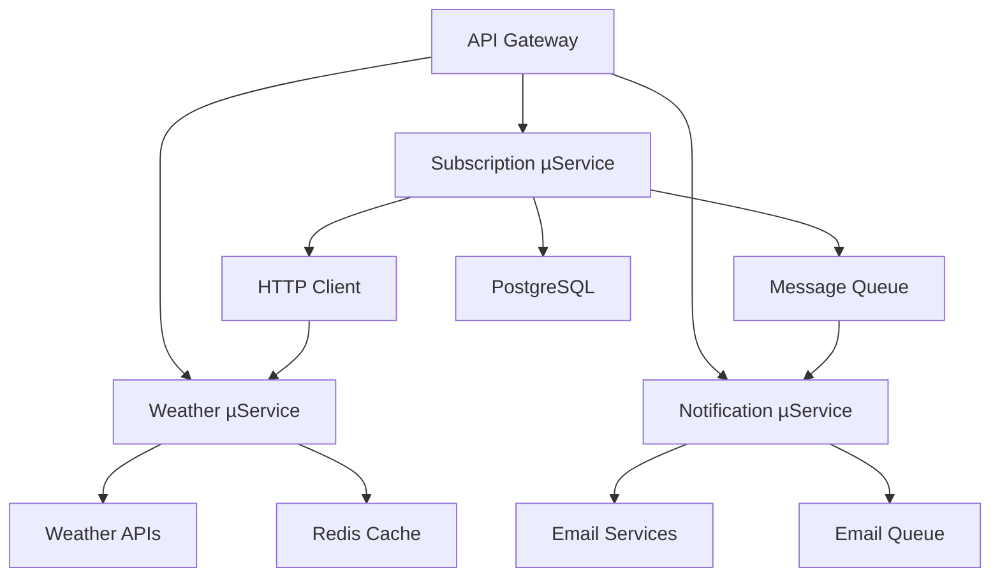

# Аналіз архітектури додатку та рекомендації щодо мікросервісів

## 📋 Огляд поточної архітектури

Додаток побудований за принципами модульної монолітної архітектури з чіткими границями між доменами та дотриманням принципів SOLID, DDD та Clean Architecture.

### Структура поточних модулів:

```
backend/src/
├── modules/
│   ├── weather/           # Weather Domain Module
│   └── subscription/      # Subscription Domain Module
├── common/
│   ├── services/         # Cross-cutting Services
│   ├── cache/           # Cache Infrastructure
│   ├── metrics/         # Monitoring Infrastructure
│   ├── middlewares/     # HTTP Middlewares
│   └── interfaces/      # Shared Interfaces
└── config/              # Configuration Management
```

### Поточні домени та їх відповідальності:

#### 1. **Weather Domain**

- **Відповідальність:** Отримання, кешування та надання погодних даних
- **Компоненти:**
  - `WeatherController` - HTTP API endpoint'и
  - `WeatherService` - бізнес-логіка для роботи з погодою
  - `WeatherProvider` - інтеграція з зовнішніми API (OpenWeatherMap, WeatherAPI)
  - `WeatherProviderChain` - failover між провайдерами
  - `CachedWeatherProvider` - кешування погодних даних

#### 2. **Subscription Domain**

- **Відповідальність:** Управління підписками користувачів на погодні оновлення
- **Компоненти:**
  - `SubscriptionController` - HTTP API endpoint'и
  - `SubscriptionService` - бізнес-логіка підписок
  - `SubscriptionRepository` - доступ до даних підписок
  - Domain entities: `Subscription`, `City`

#### 3. **Notification Domain** (у common/services)

- **Відповідальність:** Відправка email повідомлень та сповіщень
- **Компоненти:**
  - `NotificationService` - централізована логіка сповіщень
  - `EmailTemplateService` - генерація email шаблонів
  - `GmailEmailingService` - інтеграція з Gmail API
  - `BroadcastService` - масова розсилка погодних оновлень

## 🎯 Рекомендації щодо виділення мікросервісів

### 1. **Weather Service**

#### Обґрунтування для виділення:

- ✅ **Незалежна бізнес-логіка** - має власну предметну область
- ✅ **Власні зовнішні залежності** - OpenWeatherMap, WeatherAPI
- ✅ **Окремий кеш-шар** - Redis кеш для погодних даних
- ✅ **Різні SLA вимоги** - може потребувати іншого часу відповіді
- ✅ **Масштабованість** - може мати інше навантаження ніж підписки
- ✅ **Fault tolerance** - відмова не повинна впливати на управління підписками

#### Компоненти для виділення:

```typescript
// Weather Microservice
src/
├── weather-service/
│   ├── application/
│   │   ├── weather.service.ts
│   │   └── weather.controller.ts
│   ├── domain/
│   │   ├── entities/
│   │   └── errors/
│   ├── infrastructure/
│   │   ├── providers/
│   │   │   ├── openweather/
│   │   │   ├── weather-api/
│   │   │   └── cached-weather-provider.ts
│   │   └── cache/
│   └── interfaces/
```

#### API інтерфейс:

```typescript
// Endpoints:
// GET /api/weather?q=
// GET /api/city?q=

// Response DTOs
interface WeatherResponse {
  temperature: number;
  humidity: number;
  description: string;
}

interface CitySearchResponse {
  id: string;
  name: string;
  region: string;
  country: string;
  lat: number;
  lon: number;
}
```

### 2. **Notification Service**

#### Обґрунтування для виділення:

- ✅ **Окрема відповідальність** - відправка всіх типів повідомлень
- ✅ **Зовнішні інтеграції** - Gmail API, SMTP провайдери
- ✅ **Асинхронна взаємодія** - може використовувати черги повідомлень
- ✅ **Безпека** - ізоляція credentials та sensitive data
- ✅ **Rate limiting** - робота з rate-limiting від провайдерів нотифікації

#### Компоненти для виділення:

```typescript
// Notification Microservice
src/
├── notification-service/
│   ├── application/
│   │   ├── notification.service.ts
│   │   ├── email-template.service.ts
│   │   └── broadcast.service.ts
│   ├── domain/
│   │   ├── notification-types.ts
│   │   └── template-models.ts
│   ├── infrastructure/
│   │   ├── providers/
│   │   │   ├── gmail-provider.ts
│   │   │   └── smtp-provider.ts
│   │   └── queues/
│   └── interfaces/
```

#### API інтерфейс:

```typescript
// Message Queue Events
interface NotificationEvent {
  type: "email-notification";
  data: {
    email: string;
    title: string;
    body: string;
  };
}
```

### 3. **Subscription Service**

#### Обґрунтування для виділення:

- ✅ **Окрема база даних** - PostgreSQL з підписками
- ✅ **Власна бізнес-логіка** - управління життєвим циклом підписок
- ✅ **CRUD операції** - може мати власні read/write patterns
- ⚠️ **Залежність від Weather Service** - для валідації міст (оскільки Wether Service використовує геокодування специфічне для кожного з провайдерів)

#### Компоненти для виділення:

```typescript
// Subscription Microservice
src/
├── subscription-service/
│   ├── application/
│   │   ├── subscription.service.ts
│   │   └── subscription.controller.ts
│   ├── domain/
│   │   ├── entities/
│   │   │   ├── subscription.entity.ts
│   │   │   └── city.entity.ts
│   │   └── errors/
│   ├── infrastructure/
│   │   ├── repositories/
│   │   └── database/
│   └── interfaces/
```

#### API інтерфейс:

```typescript
// HTTP REST API:
POST    /api/subscriptions;
GET     /api/subscriptions/confirm/:token;
GET     /api/subscriptions/unsubscribe/:token

// Internal API for Broadcast Service
GET     /api/internal/subscriptions?status=confirmed&frequency=hourly
```

## **Shared Code**

#### Причини залишити в спільній бібліотеці:

- 🔄 **Shared concerns** - використовується всіма сервісами
- 🔄 **Cross-cutting functionality** - логування, метрики, помилки
- 🔄 **Складність координації** - між різними сервісами
- 🔄 **Overhead** - додаткова складність без бізнес-цінності

#### Компоненти для винесення у shared library:

```typescript
// @company/shared-infrastructure
├── cache/
├── metrics/
├── logging/
├── http-client/
├── error-handling/
└── interfaces/
```

## 📊 Переваги запропонованої мікросервісної архітектури

### Технічні переваги:

#### 🚀 **Незалежне розгортання**

- Кожен сервіс може оновлюватися та розгортатися незалежно
- Менші ризики при релізах
- Швидші цикли розробки

#### 📈 **Горизонтальна масштабованість**

- Weather Service може мати більше інстансів під час пікового навантаження
- Notification Service може масштабуватися залежно від кількості email'ів
- Різні ресурсні потреби для різних сервісів

#### 🛡️ **Ізоляція відмов (Fault Isolation)**

- Відмова Weather API не вплине на управління підписками
- Проблеми з email-провайдером не заблокують отримання погоди
- Кращий overall availability

#### 🔧 **Технологічна різноманітність**

- Можливість використання різних технологій для різних задач
- Weather Service може використовувати GraphQL
- Notification Service може використовувати event-driven архітектуру

### Бізнес переваги:

#### 👥 **Team Ownership**

- Різні команди можуть володіти різними сервісами
- Чіткі границі відповідальності
- Менше конфліктів у коді

#### ⚡ **Швидкість розробки**

- Паралельна розробка функцій
- Менші codebase'и для розуміння
- Швидші збірки та тести

#### 💰 **Оптимізація ресурсів**

- Різні потреби в CPU/Memory/Network для різних сервісів
- Можливість використання різних instance types
- Кращий cost-efficiency

## 🔄 Стратегія міграції

### Фаза 1: Виділення Weather Service (1-2 тижні)

#### Кроки:

1. **Створити новий Weather Service проект**
2. **Перенести weather-related код**
3. **Налаштувати HTTP API**
4. **Оновити Subscription Service для використання HTTP клієнта**
5. **Налаштувати моніторинг та логування**



#### Зміни в коді:

```typescript
// subscription.service.ts - замість прямого виклику
// OLD: this.weatherProvider.searchCity(city)
// NEW:
const cities = await this.weatherHttpClient.searchCity(city);
```

### Фаза 2: Виділення Notification Service (2-3 тижні)

#### Кроки:

1. **Створити Notification Service**
2. **Налаштувати Message Queue (Redis/RabbitMQ)**
3. **Перенести email-related логіку**
4. **Оновити інші сервіси для використання events/HTTP**
5. **Налаштувати async processing**



#### Зміни в коді:

```typescript
// subscription.service.ts - замість прямого виклику
// OLD: await this.notificationService.sendSubscriptionConfirmation(...)
// NEW:
await this.messageQueue.publish("subscription.confirmation", {
  email,
  confirmationUrl,
  cityFullName,
  frequency,
});
```

### Фаза 3: Повна мікросервісна архітектура (1-2 тижні)

#### Кроки:

1. **Додати API Gateway**
2. **Налаштувати Service Discovery**
3. **Розділити бази даних**
4. **Додати Circuit Breakers**
5. **Налаштувати distributed tracing**



## 🛠️ Технічні рекомендації з імплементації

### 1. **Комунікація між сервісами**

#### Синхронна комунікація (HTTP REST):

```typescript
// Weather Service клієнт
export class WeatherServiceClient {
  async getWeatherByCity(city: string): Promise<WeatherResponse> {
    const response = await this.httpClient.get(`/api/weather/city/${city}`);
    return response.data;
  }

  async searchCity(query: string): Promise<CitySearchResponse[]> {
    const response = await this.httpClient.get(`/api/weather/search/${query}`);
    return response.data;
  }
}
```

#### Асинхронна комунікація (Message Queue):

```typescript
// Event-driven для notifications
export interface NotificationEvent {
  type: 'weather.notification' | 'subscription.confirmation' | 'subscription.confirmed' | 'subscription.cancelled';
  correlationId: string;
  timestamp: Date;
  data: any;
}

// Publisher (у Subscription Service)
await this.eventBus.publish('subscription.confirmation', {
  correlationId: uuid(),
  data: { email, confirmationUrl, cityFullName, frequency }
});

// Consumer (у Notification Service)
@EventHandler('subscription.confirmation')
async handleSubscriptionConfirmation(event: NotificationEvent) {
  await this.sendSubscriptionConfirmation(event.data);
}
```

### 2. **Обробка помилок та resilience**

#### Circuit Breaker Pattern:

```typescript
export class WeatherServiceClient {
  private circuitBreaker = new CircuitBreaker(this.makeRequest.bind(this), {
    timeout: 5000,
    errorThresholdPercentage: 50,
    resetTimeout: 30000,
  });

  async getWeatherByCity(city: string): Promise<WeatherResponse> {
    try {
      return await this.circuitBreaker.fire(city);
    } catch (error) {
      // Fallback to cached data or default response
      return this.getCachedWeather(city);
    }
  }
}
```

#### Retry Pattern:

```typescript
@Retryable({
  maxAttempts: 3,
  backoff: ExponentialBackoff(1000, 2, 10000)
})
async sendNotification(data: NotificationData): Promise<void> {
  await this.emailProvider.send(data);
}
```

### 3. **Моніторинг та observability**

#### Distributed Tracing:

```typescript
// Додати tracing headers
export class HttpTracingInterceptor {
  intercept(request: HttpRequest): HttpRequest {
    return request.clone({
      setHeaders: {
        "X-Trace-Id": this.traceService.getTraceId(),
        "X-Span-Id": this.traceService.createSpan(),
      },
    });
  }
}
```

#### Metrics для кожного сервіса:

```typescript
// Weather Service metrics
this.metricsService.createCounter("weather_api_requests_total", [
  "provider",
  "status",
]);
this.metricsService.createHistogram("weather_api_duration_seconds", [
  "provider",
]);
this.metricsService.createGauge("weather_cache_hit_ratio");

// Notification Service metrics
this.metricsService.createCounter("notifications_sent_total", [
  "type",
  "status",
]);
this.metricsService.createHistogram(
  "notification_processing_duration_seconds",
  ["type"]
);
```

### 4. **Безпека та авторизація**

#### Service-to-Service Authentication:

```typescript
// JWT токени для внутрішньої комунікації
export class ServiceAuthInterceptor {
  intercept(request: HttpRequest): HttpRequest {
    const token = this.generateServiceToken();
    return request.clone({
      setHeaders: {
        Authorization: `Bearer ${token}`,
        "X-Service-Name": this.serviceName,
      },
    });
  }
}
```

### 5. **Configuration Management**

#### Централізована конфігурація:

```typescript
// Config Service або environment-specific configs
export interface ServiceConfig {
  weatherService: {
    url: string;
    timeout: number;
    retries: number;
  };
  notificationService: {
    url: string;
    queueName: string;
  };
  database: {
    host: string;
    port: number;
    name: string;
  };
}
```

## 🚧 Потенційні виклики та рішення

### 1. **Distributed Data Management**

#### Проблема: Транзакції між сервісами

```typescript
// Sage Pattern для distributed transactions
export class SubscriptionSaga {
  async execute(subscriptionData: SubscriptionData): Promise<void> {
    const sagaId = uuid();

    try {
      // Step 1: Validate city
      const city = await this.weatherService.validateCity(
        subscriptionData.city
      );

      // Step 2: Create subscription
      const subscription = await this.subscriptionService.create({
        ...subscriptionData,
        city,
      });

      // Step 3: Send confirmation
      await this.notificationService.sendConfirmation(subscription);
    } catch (error) {
      // Compensating actions
      await this.compensate(sagaId, error);
    }
  }
}
```

### 2. **Data Consistency**

#### Проблема: Eventual Consistency

```typescript
// Event Sourcing для критичних операцій
export class SubscriptionEventStore {
  async appendEvent(event: DomainEvent): Promise<void> {
    await this.eventStore.append(event);
    await this.publishEvent(event);
  }

  async replayEvents(aggregateId: string): Promise<Subscription> {
    const events = await this.eventStore.getEvents(aggregateId);
    return Subscription.fromEvents(events);
  }
}
```

### 3. **Service Discovery**

#### Рішення: Consul або Kubernetes Service Discovery

```typescript
export class ServiceRegistry {
  async registerService(service: ServiceInfo): Promise<void> {
    await this.consul.register({
      name: service.name,
      address: service.address,
      port: service.port,
      healthCheck: service.healthCheckUrl,
    });
  }

  async discoverService(serviceName: string): Promise<ServiceInfo[]> {
    return await this.consul.discover(serviceName);
  }
}
```

## 📈 Метрики успіху міграції

### Технічні метрики:

- **Deployment frequency** - збільшення частоти релізів
- **Lead time** - зменшення часу від коміту до продакшну
- **MTTR** - зменшення часу відновлення після інцидентів
- **Change failure rate** - зменшення кількості проблемних релізів

### Бізнес метрики:

- **Feature delivery velocity** - швидкість доставки нових функцій
- **System availability** - загальна доступність системи
- **Scalability metrics** - можливість обробки більшого навантаження
- **Cost efficiency** - оптимізація витрат на інфраструктуру

## 🎯 Висновки та наступні кроки

### Рекомендований план дій:

1. **Почати з Weather Service** - найменше залежностей та найчіткіші границі
2. **Поступово виділити Notification Service** - додати асинхронну обробку
3. **Завершити Subscription Service** - після налагодження комунікації
4. **Додати API Gateway та Service Discovery** - для production-ready setup

### Ключові принципи:

- **Incremental migration** - поступова міграція без big bang
- **Backward compatibility** - підтримка старих API під час переходу
- **Monitoring first** - налаштування метрик та логування з самого початку
- **Rollback strategy** - можливість швидкого повернення до моноліту

### Довгострокові вигоди:

- Незалежні команди розробки
- Гнучка архітектура для майбутнього зростання
- Кращі можливості тестування та debugging
- Оптимальне використання ресурсів

Ця архітектура забезпечить надійну основу для подальшого розвитку додатку з можливістю незалежного масштабування та розвитку окремих компонентів.
